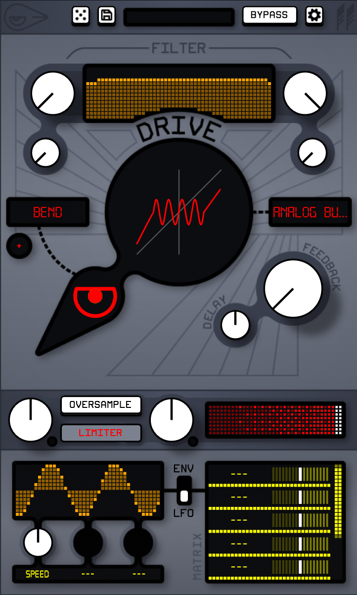
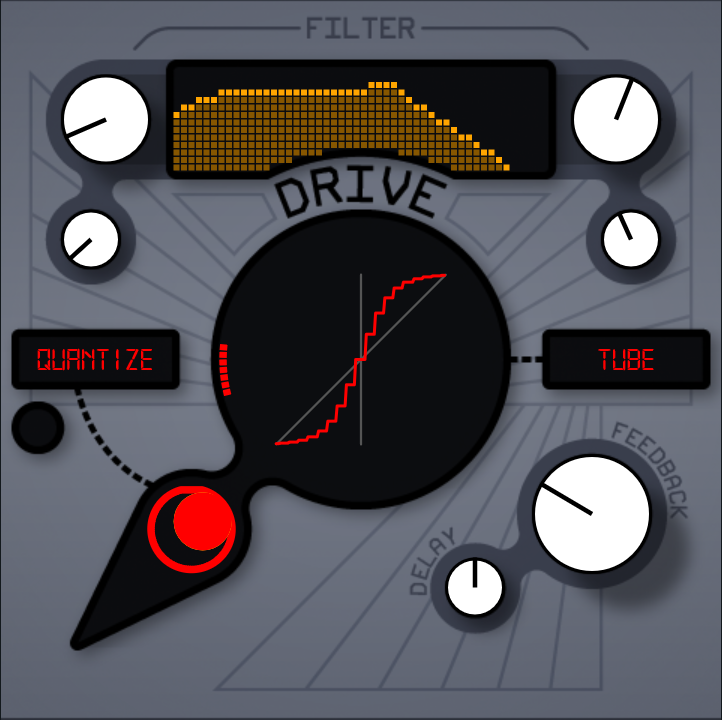
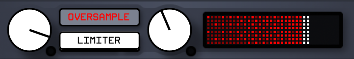
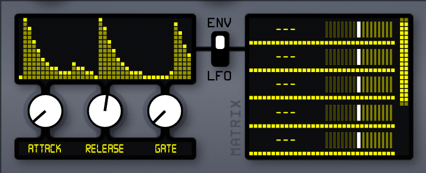
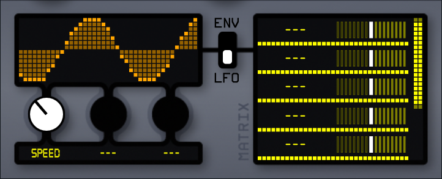

# Ignitive (v0.9.0 Pre-release)

---

## Introduction

**Ignitive** is a modular distortion plugin built with JUCE, designed for creative sound shaping. It's designed to be as simple or as complex as you choose to make it. A collection of distortion algorithms and "character" modifiers allow for endless combinations.

Key features include:

* Multiple distortion algorithms and “character” modifiers for endless tonal possibilities.
* Envelope and LFO modulators that can control multiple parameters in real time.
* A flexible pre-filter section with independent high-pass and low-pass filters, plus a delay feedback stage for extra texture.

**Ignitive** is a personal project made with the goal of learning and hopefully producing a well-documented example of a JUCE plugin.

---

## Installation

[Download here](https://github.com/bluesqqq/Ignitive/releases/tag/v0.9.0)

---

## How to Use

**Ignitive**'s interface consists of three panels, four if you count the top bar.

### Main Panel

#### Filter
* The left side controls the highpass filter.
* The right side controls the lowpass filter.
* The larger knob controls cutoff frequency.
* The smaller knob contorls resonance (Q).
#### Distortion
* The big screen in the center controls the drive amount.
* The selector on the right sets the distortion algorithm.
* The bird's eye controls the "character" modifier amount.
* The selector on the left sets the character type.
* The button below the character selector sets the character's polarity (if applicable).
#### Feedback
* The big feedback knob controls the feedback amount mixed back into the signal.
* The delay knob controls the delay time of the feedback.

### Gain Panel

* The left knob controls the in gain.
* The OVERSAMPLING button toggles distortion oversampling (4x) on and off.
* The LIMITER button toggle the built-in limiter on and off.
* The right knob controls the out gain.
* The slider controls the dry/wet mix, left being 0% and right being 100%.

### Modulation Panel

#### Matrix
* The LFO/ENV switch toggles between LFO and envelope view.
* You can set destinations and modulation depths in the modulation slots.
#### Envelope
* The attack knob sets the attack speed (0ms to 200ms).
* The release knob sets the release speed (0ms to 400ms).
* The gate knob sets the gate threshold (-100dBs to 0dBs).
#### LFO
* The speed knob sets the lfo speed 0.1hz to 10hz.
